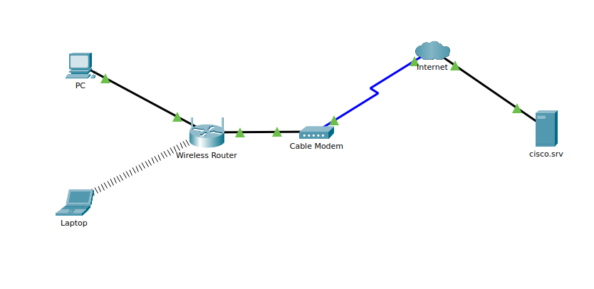

# 2.1 Packet Tracer - Create a Simple Network & Advanced Features

## Network Connections & Device Config

### IP Configuration Types
*   **DHCP (Dynamic):** Auto-assigns IP addresses to devices on the network.
*   **Static:** Manually typing an IP address into device settings.

### Common Packet Tracer Cable Types
```
[ PC ] --- (Straight-Through Cable) ---> [ Switch / Router ]
[ Modem ] --- (Coaxial Cable) ---------> [ ISP Cloud ]
```
*   **Copper Straight-Through:** Connects different device types (PC to Switch/Router).
*   **Copper Crossover:** Connects similar device types (PC to PC, Switch to Switch).
*   **Coaxial Cable:** Connects modems to ISP infrastructure.

---

## Lab Workflow: Building & Testing a Network



### Step-by-Step Setup
1.  **Add Devices:** Drag PC, Laptop, and Cable Modem into the Logical Workspace.
2.  **Rename Devices:** Open device -> **Config Tab** -> change **Display Name**.
3.  **Physical Cabling:**
    *   PC (`FastEthernet0`) to Wireless Router (`Ethernet 1`) via **Copper Straight-Through**.
    *   Wireless Router (`Internet`) to Cable Modem (`Port 1`) via **Copper Straight-Through**.
    *   Cable Modem (`Port 0`) to Internet Cloud (`Coaxial 7`) via **Coaxial Cable**.
4.  **Configure PC (Wired):**
    *   Go to **Desktop** -> **IP Configuration** -> Select **DHCP**.
    *   Verify setup: Open **Command Prompt**, type `ipconfig /all` to confirm IP (`192.168.0.x`), then test connectivity using `ping cisco.srv`.
5.  **Configure Laptop (Wireless):**
    *   Go to **Physical Tab** -> Power Off -> Swap Ethernet module for **WPC300N Wireless Module** -> Power On.
    *   Go to **Desktop** -> **PC Wireless** -> Connect to `HomeNetwork`.
    *   Test connection: Open **Web Browser** -> go to `cisco.srv`.

> **Security Note:** Unsecured Wi-Fi networks (like connecting without WPA2/WPA3 passwords) allow attackers on the same airwaves to capture unencrypted traffic using packet sniffers.

---

## Key IP Networking Terms

*   **IPv4 Address:** Unique identifier for a device on a network (e.g., `192.168.0.2`).
*   **Subnet Mask:** Defines which part of the address is the network vs. host (e.g., street name vs. house number).
*   **Default Gateway:** The exit router interface that forwards local traffic to outside networks/internet.

---

## Advanced Features & Customization

*   **Background Images:** Use top-left **Image Icon** to set custom topology diagrams or floor plans.
*   **Device Icons:** Customize physical/logical icons via device properties (especially useful for IoT devices with non-standard interfaces).