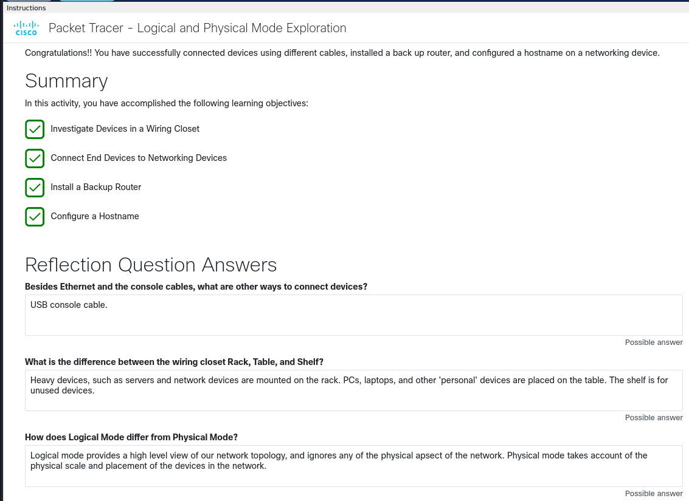

# 1.1 The Cisco Packet Tracer Interface

## Contents
- 1.1.1 Video - The Packet Tracer User Interface
- 1.1.2 Video - Deploying Devices
- 1.1.3 GUI and CLI Configuration in Cisco Packet Tracer
- 1.1.4 Video - Packet Tracer Tutored Activity
- 1.1.5 Video - Using PTTA Activities: Logical and Physical Mode
- 1.1.6 Packet Tracer Tutored Activity - Logical and Physical Mode Exploration

## Notes

### 1.1.1 The Packet Tracer User Interface
Packet Tracer provides three main menus:
- Add devices and connect them via cables or wireless
- Select, delete, inspect, label, and group components within the network
- Manage the network

The network management menu allows you to:
- Open an existing/sample network
- Save the current network
- Modify your user profile or preferences

### 1.1.3 GUI and CLI Configuration
Packet Tracer provides several tabs for device configuration:

- **Physical** — Interact with the device itself: power it on/off, install modules (e.g. a wireless NIC).
- **Config** — Simple text boxes, buttons, and drop-down menus for setup. Unlike the CLI tab, the Config tab does not simulate real device functionality — settings entered here (e.g. IP address, hostname) are auto-converted by Packet Tracer into Cisco commands applied in the background.
- **CLI** (Command Line Interface) — Type exact Cisco IOS commands directly to configure the device.
- **Desktop** — Available on end devices like PCs and laptops; gives access to IP configuration, wireless configuration, a command prompt, a web browser, and other apps.
- **Services** — Only on servers; lets you configure common server processes such as HTTP, DHCP, or DNS.

> Note: Other tabs may appear on certain devices but are beyond the scope of this course.

### 1.1.4 Packet Tracer Tutored Activity (PTTA)
In a PTTA, you're guided through the activity based on a hint level you choose, and can change it at any time. Not all Packet Tracer activities are PTTAs — some don't include the hint system.

### 1.1.5 Using PTTA Activities: Logical and Physical Mode
In Physical Mode, right-click a device to view its front or back. Use the magnifying glass to zoom in on ports for a closer look.

To run cables in Physical Mode: click the pegboard or rack wires, select the cable type, then click the port on each end (one click per port). To cancel a cable in progress, press **Esc** or click the cable type again.

### 1.1.6 PTTA - Logical and Physical Mode Exploration

This was my first PTTA. I set the hint level to none to challenge myself.

#### Objectives
- Investigate devices in a wiring closet
- Connect end devices to networking devices
- Install a backup router
- Configure a hostname

#### Background / Scenario
The network in this PTTA reflects a simplified small-to-medium business network, split across the Seward Branch Office (top left) and the Warrenton data center (bottom right). Most devices are already deployed and configured — the task is to review them, not necessarily understand every detail.

Packet Tracer has two viewing modes:
- **Logical mode** — shows how devices are connected.
- **Physical mode** — shows where devices are physically located.

This activity opens in Physical mode. Switch between modes anytime with **Shift-L** (Logical) and **Shift-P** (Physical), though some activities lock you into one mode.

#### FAQs
- **Cities connected (Physical Mode):** Warrenton and Seward
- **Submarine cable name:** Alaska United West (AU-West)
- **Wireless devices in the Teleworker Home:** Smartphone and Home_Laptop
- **Facility enterable in Seward:** Branch Office
- **Facilities enterable in Warrenton:** Data Center and Teleworker

#### Result: 100% correct

---

### Actions Taken

**Navigate to the Branch Office wiring closet and connect a PC to a switch.**
- Went to Physical mode → Seward → Branch Office → Branch Office Wiring Closet.
- Connected PC_1's FastEthernet0 port to ALS2's FastEthernet0/1 port using a copper straight-through cable.

**Connect a PC to a router via console cable (for management access).**
- Connected the RS232 port on PC_1 to the Console port on Edge_Router.

**Install and power on a backup router.**
- Retrieved Backup_Router from the Shelf and installed it in the Rack.
- Powered it on via the rear power switch.

**Connect a laptop to the backup router via USB console.**
- Connected Laptop_1 to Backup_Router's console port using a USB cable (useful since newer laptops often lack an RS232 port).

**Access the CLI and configure the hostname.**
- On Laptop_1, opened the Desktop tab → Terminal, and connected using the default settings.
- At the initial configuration prompt, answered **no** to reach the `Router>` prompt.
- Ran the following commands to rename the router to `Edge_Router_Backup`:
```
Router> enable
Router# configure terminal
Router(config)# hostname Edge_Router_Backup
Edge_Router_Backup(config)# end
```

### Reflection

**Besides Ethernet and console cables, what other ways can devices connect?**
USB cable.

**What's the difference between the Rack, Table, and Shelf in the wiring closet?**
The Rack holds active networking devices (routers, switches). The Table holds end devices (PCs, laptops). The Shelf is storage for devices not currently deployed, like backup routers.

**How does Logical mode differ from Physical mode?**
Physical mode mirrors real-world layout and visualization. Logical mode is simpler and cleaner, focused purely on how devices connect to each other.

