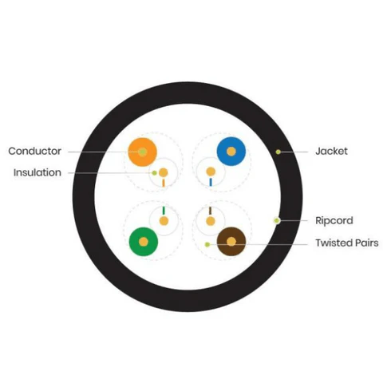

# 4.2 Network Technologies in the Home

---

## Wireless Frequencies

Wireless networks in the home operate on **unlicensed frequency bands** (no government permit required to use them):

| Band / Tech | Standard / Scope | Characteristics | Common Uses |
|---|---|---|---|
| **2.4 GHz Band** | Bluetooth, Wi-Fi (802.11) | Longer range, passes through walls easily, higher signal interference | Mice, keyboards, smart home devices, basic Wi-Fi |
| **5 GHz Band** | Wi-Fi (802.11) | Faster speeds/throughput, shorter range, less wall penetration | High-bandwidth video streaming, gaming, large file downloads |

> **Security Note:** Because 2.4 GHz and 5 GHz bands are unlicensed, attackers can easily use off-the-shelf hardware to sniff unencrypted traffic or set up rogue access points without special licensing.

---

## Wired Network Technologies

Wired connections provide dedicated, unshared bandwidth and immunity to radio frequency interference.

| Cable Type | Construction | Best Used For |
|---|---|---|
| **Category 5e (Cat 5e)** | 4 twisted pairs of copper wires | Standard LAN home connections using RJ-45 jacks |
| **Coaxial Cable** | Center wire surrounded by tubular insulation and a metallic shield | Cable internet modems, TV line connections |
| **Fiber-Optic Cable** | Ultra-thin glass/plastic strands carrying light signals | High-speed, long-distance backbone connections |

---

## Quick Quiz Notes
- **Unlicensed Spectrum:** Certain electromagnetic spectrum areas (like 2.4 GHz and 5 GHz) can be used publicly without a permit.
- **Coaxial Cable:** Features a center conductor surrounded by an insulating layer and a protective conductive metal shield.
- **Different Frequency Uses:** While Wi-Fi and Bluetooth share 2.4 GHz, devices use different protocols and modulation techniques so they don't operate on identical channel structures.