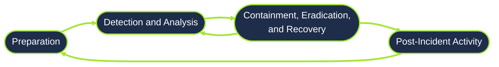

# Defensive Security Intro
---

## Content
- Task 1 - Introduction to Defensive Security
- Task 2 - Areas of Defensive Security
- Task 3 - Practical Example of Defensive Security

## My Understanding 
### Task 1 - Introduction to Defensive Security
> In the previous lesson, we learned about offensive security. In this lesson, we will examine its counterpart, defensive security. It is concerned with two main tasks:
1. Preventing intrusions from occurring
2. Detecting intrusions when they occur and responding properly

Blue teams are part of the defensive security landscape.
#### Tasks Related to Defensive Security:
- **User cyber security awareness:** Training users about cyber security helps protect against attacks targeting their systems.
- **Updating and patching systems:** Ensuring that computers, servers, and network devices are correctly updated and patched against any known vulnerability (weakness).
- **Setting up preventative security devices:** firewall and intrusion prevention systems (IPS) are critical components of preventative security. Firewalls control what network traffic can go inside and what can leave the system or network. IPS blocks any network traffic that matches present rules and attack signatures.
- **Setting up logging and monitoring devices:** Proper network logging and monitoring are essential for detecting malicious activities and intrusions. If a new unauthorized device appears on our network, we should be able to detect it.

We will also cover the following related topics:
- [Security Operations Center (SOC)](#security-operations-center-soc)
- [Threat Intelligence](#threat-intelligence)
- [Digital Forensics and Incident Response (DFIR)](#digital-forensics-and-incident-response-dfir)
- [Malware Analysis](#malware-analysis)

#### Questions:
1. Which team focuses on defensive security?
> My answer: Blue Team  
> Result: Correct

---

### Task 2 - Areas of Defensive Security
In this task, we will cover two main topics related to defensive security:
- Security Operations Center (SOC), where we cover Threat Intelligence
- Digital Forensics and Incident Response (DFIR), where we also cover Malware Analysis

#### Security Operations Center (SOC)
A Security Operations Center (SOC) is a team of cyber security professionals that monitors the network and its systems to detect malicious cyber security events.
Some of the main areas of interest for a SOC are:
- Vulnerabilities: Whenever a system vulnerability (weakness) is discovered, it is essential to fix it by installing a proper update or patch. When a fix is unavailable, the necessary measures should be taken to prevent an attacker from exploiting it. Although remediating vulnerabilities is vital to a SOC, it is not necessarily assigned to them.
- Policy violations: A security policy is a set of rules required to protect the network and systems. For example, it might be a policy violation if users upload confidential company data to an online storage service.
- Unauthorized activity: Consider the case where a user’s login name and password are stolen, and the attacker uses them to log into the network. A SOC must detect and block such an event as soon as possible before further damage is done.

Security operations cover various tasks to ensure protection, one such task is threat intelligence.

#### Threat Intelligence
In this context, intelligence refers to information you gather about actual and potential enemies. A threat is any action that can disrupt or harmful affect a system. Threat intelligence collects information to help the company better prepare against potential adversaries.

#### Digital Forensics and Incident Response (DFIR)
This section is about Digital Forensics and Incident Response (DFIR), and we will cover:
- [Digital Forensics](#digital-forensics)
- [Incident Response](#incident-response)
- [Malware Analysis](#malware-analysis)

#### Digital Forensics
In defensive security, the focus of digital forensics shifts to analyzing evidence of an attack and its perpetrators and other areas such as intellectual property theft, cyber espionage, and possession of unauthorized content. Consequently, digital forensics will focus on different areas, such as:
- **File System:** Analyzing a digital forensics image (low-level copy) of a system’s storage reveals much information, such as installed programs, created files, partially overwritten files, and deleted files.
- **System memory:** If the attacker runs their malicious program in memory without saving it to the disk, taking a forensic image (low-level copy) of the system memory is the best way to analyze its contents and learn about the attack.
- **System logs:** Each client and server computer maintains different log files about what is happening. Log files provide plenty of information about what happened on a system. Even if the attacker tries to clear their traces, some traces will remain.
- **Network logs:** Logs of the network packets that have traversed a network would help answer more questions about whether an attack is occurring and what it entails.

#### Incident Response
Examples of a cyber attack include an attacker making our network or systems inaccessible, defacing (changing) the public website, and data breach (stealing company data). How would you respond to a cyber attack? Incident response specifies the methodology that should be followed to handle such a case. The aim is to reduce damage and recover in the shortest time possible. Ideally, you would develop a plan that is ready for incident response.

The four major phases of the incident response process
1. **Preparation:** This requires a team trained and ready to handle incidents. Ideally, various measures are put in place to prevent incidents from happening in the first place.
2. **Detection and Analysis:** The team has the necessary resources to detect any incident; moreover, it is essential to analyze any detected incident further to learn about its severity.
3. **Containment, Eradication, and Recovery:** Once an incident is detected, it is crucial to stop it from affecting other systems, eliminate it, and recover the affected systems. For instance, when we notice that a system is infected with a computer virus, we would like to stop (contain) the virus from spreading to other systems, clean (eradicate) the virus, and ensure proper system recovery.
4. **Post-Incident Activity:** After a successful recovery, a report is produced, and the lesson learned is shared to prevent similar future incidents.

#### Malware Analysis
Malware stands for malicious software. Software refers to programs, documents, and files you can save on a disk or send over the network. Malware includes many types, such as:
- **Virus** is a piece of code (part of a program) that attaches itself to a program. It is designed to spread from one computer to another and works by altering, overwriting, and deleting files once it infects a computer. The result ranges from the computer becoming slow to unusable.
- **Trojan Horse** is a program that shows one desirable function but hides a malicious function underneath. For example, a victim might download a video player from a shady website that gives the attacker complete control over their system.
- **Ransomware** is a malicious program that encrypts the user’s files. Encryption makes the files unreadable without knowing the encryption password. The attacker offers the user the encryption password if the user is willing to pay a “ransom.”

Malware analysis aims to learn about such malicious programs using various means:
1. **Static analysis** works by inspecting the malicious program without running it. This usually requires solid knowledge of assembly language (the processor’s instruction set, i.e., the computer’s fundamental instructions).
2. **Dynamic analysis** works by running the malware in a controlled environment and monitoring its activities. It lets you observe how the malware behaves when running.

#### Questions:
What would you call a team of cyber security professionals that monitors a network and its systems for malicious events?
> My answer: Security Operations Center  
> Result: Correct!  

What does DFIR stand for?
> My answer: Digital Forensics and Incident Response
> Result: Correct!

Which kind of malware requires the user to pay money to regain access to their files?
> My answer: Ransomware  
> Result: Correct!

### Task 3 - Practical Example of Defensive Security
#### The Scenario
Let us pretend you are a Security Operations Center (SOC) analyst responsible for protecting a bank. This bank's SOC uses a Security Information and Event Management (SIEM) tool, which gathers security-related information and events from various sources and presents them in one dashboard. If the SIEM finds something suspicious, an alert will be generated.

Not all alerts are malicious, however. It is up to the analyst to use their expertise in cyber security to investigate which ones are harmful.

For example, you may encounter an alert where a user has failed multiple login attempts. While suspicious, this kind of thing happens, especially if the user has forgotten their password and continues to try to log in. 

#### Simulating a SIEM
They have prepared a simplified, interactive simulation of a SIEM system to provide me with a hands-on experience similar to what cyber security analysts encounter.

There is a lab pop up that have  


#### Given Information/What i am seeing
- Site URL: https://siem.internal
- Countries
  - UK - Count 60 
  - US - Count 30
  - Brazil - Count 21
  - China - Count 4
  - Russia - Count 15
  - N.Korea - Count 17
- Information
  - Operations: Information - 40%
  - Security: Attack - 30%
  - Security: Suspicious - 30%
- Alert Log

| Date | Message |
|---|---|
|undefined 6th 2026, 06:14:43:097|Successful SSH authentication attempt to port 22 from IP address 143.110.250.149|
|undefined 6th 2026, 06:18:12:104| Unauthorized connection attempt detected from IP address 143.110.250.149 to port 22 |
| undefined 6th 2026, 04:01:28:275 | The user John Doe logged in successfully (Event ID 4624) |
| undefined 6th 2026, 04:01:50:287 | Multiple failed login attempts from John Doe |
| undefined 6th 2026, 03:51:23:252 | Logon Failure: Specified Account's Password Has Expired (Event ID 535) |

#### What i did:
**First Instructions:** "Inspect the alerts in your SIEM dashboard. Find the malicious IP address from the alerts, make a note of it, and then click on the alert to proceed."

I see the red alert on message `Unauthorized connection attempt detected from IP address 143.110.250.149 to port 22`
I copy the suspicious IP address (`143.110.250.149`) first before clicking it.

**Second Instructions:** "There are websites on the Internet that allow you to check the reputation of an IP address to see whether it's malicious or suspicious."

After I clicked the suspicious ip, it goes to URL: https://ip-scanner.thm that look like this:

```
        IP-SCANNER.THM

        check by IP address
        Enter IP Address:   Submit
```
I submitted the suspicious IP address to check weather it's suspicious or malicious.

**Third Instructions:** "There are many open-source databases out there, like AbuseIPDB, and Cisco Talos Intelligence, where you can perform a reputation and location check for the IP address. Most security analysts use these tools to aid them with alert investigations. You can also make the Internet safer by reporting the malicious IPs, for example, on AbuseIPDB.
Now that we know the IP address is malicious, we need to escalate it to a staff member!"

The site telling me that the suspicious IP is 100% Malicious and was found in their database.  
**The ISP:** China Mobile Communications Corporation  
**Domain Name:** chinamobileltd.thm  
**Country:** China  
**City:** Zhenjiang, Jiangsu  

**Fourth Instructions:** "We shouldn't worry too much if it was a failed authentication attempt, but you probably noticed the successful authentication attempt from the malicious IP address. Let's declare a small incident event and escalate it. There is some great staff working at the company, but you wouldn't want to escalate this to the wrong person who is not in charge of your team or department."
"Choose to whom you would escalate this event?"
- [ ] Sales Executive
- [ ] Security Coonsuultant
- [ ] Information Security Architect
- [x] SOC Team Lead


Since we didnt tackle 3 of these roles and i only know yet is the SOC Team and for me this is the best fit so far.
> Result: Correct!

**Fifth Instructions:** "You got the permission to block the malicious IP address, and now you can proceed and implement the block rule. Block the malicious IP address on the firewall and find out what message they left for you."

Since we knew that suspicious IP is no longer Suspicious instead it is 100% confirm malicious